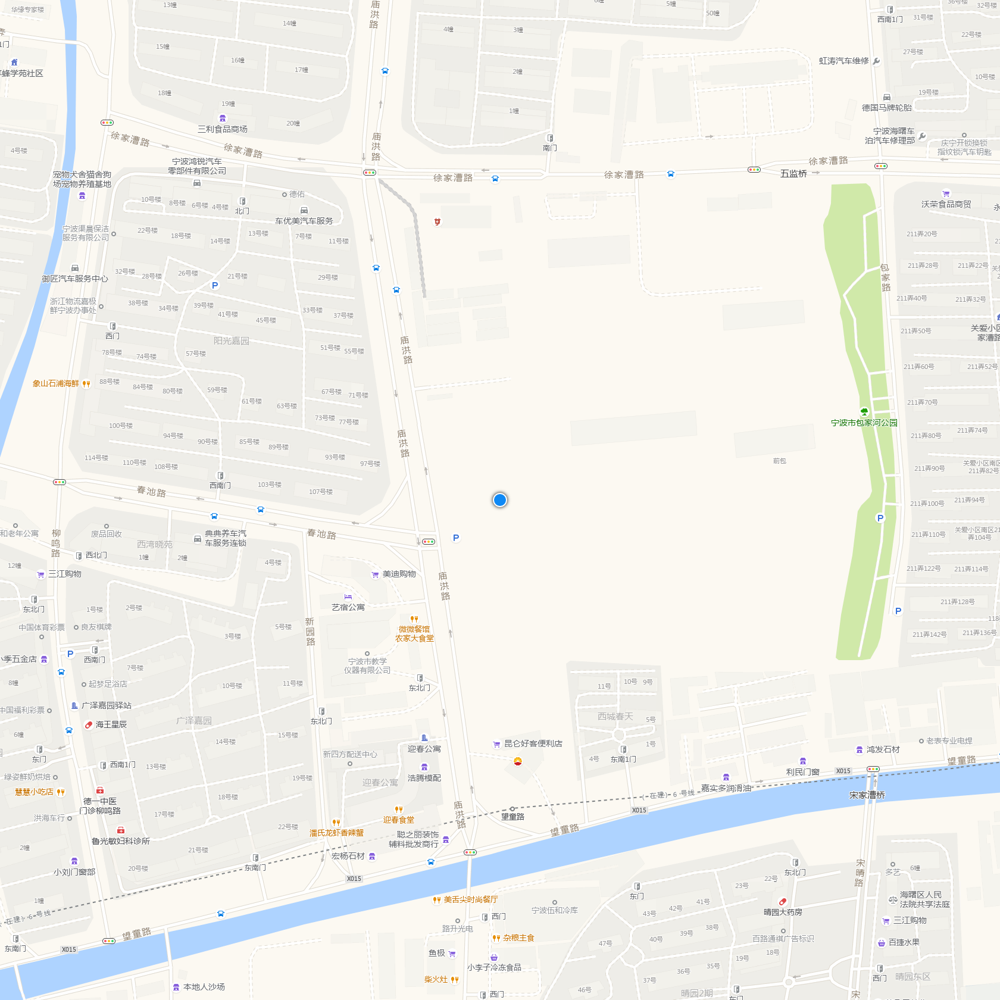
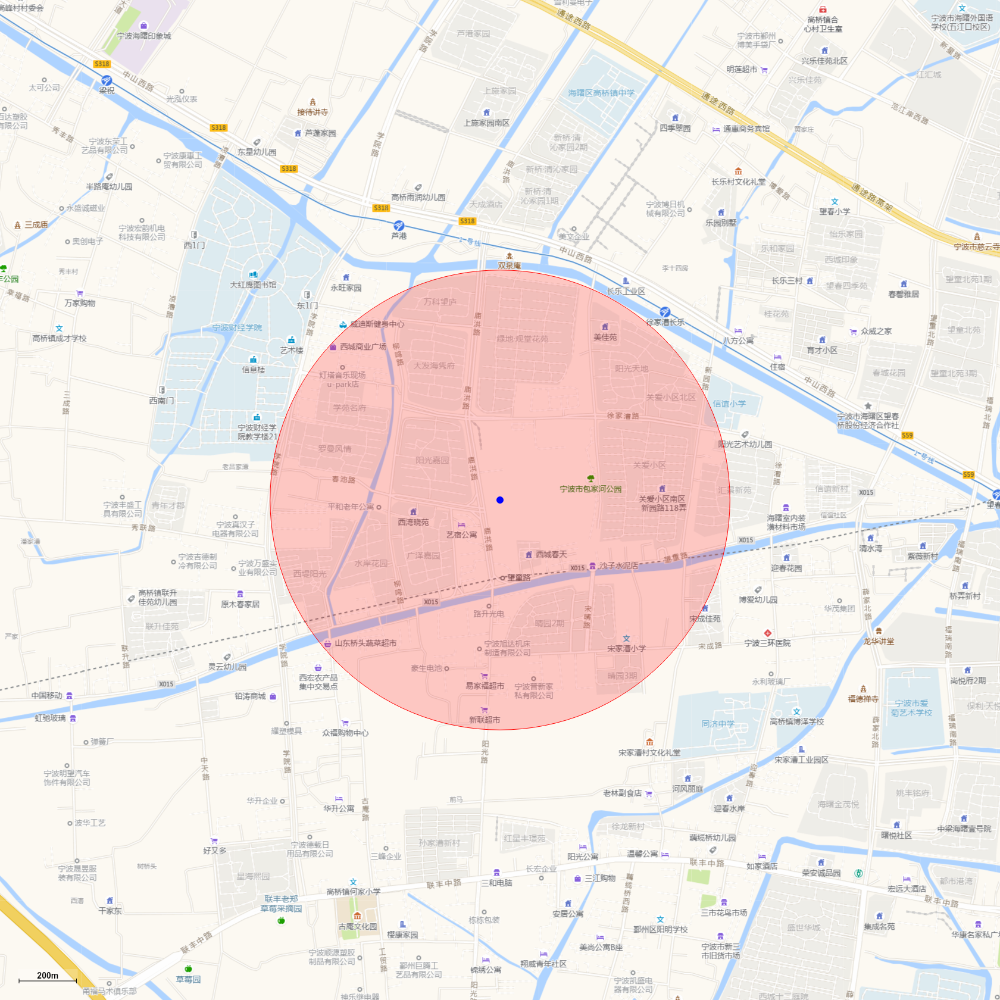

## Usage

```shell
$ geo --data '[121.486537, 29.884145]' --zoom 18 > location.png
```




```shell
$ curl -s  -H "Cookie: $cookie" "https://60.190.56.95/trackapi/lastpoints"  \
| jq 'map(.coordinate)' \
| geo --data @- --zoom 12 --width 4800 --height 4800 > points.png
```


```shell
$ curl -s  -H "Cookie: $cookie" "https://60.190.56.95/trackapi/lastpoints"  \
| jq 'map(.coordinate)' \
| geo --data @- --zoom 12 --width 4800 --height 4800 --type cluster > cluster.png
```


```shell
$ curl -s  -H "Cookie: $cookie" "https://60.190.56.95/trackapi/lastpoints" \
| jq 'map(.coordinate)' \
| geo --data @- --zoom 12 --width 4800 --height 4800 --type hexbin > hexbin.png
```


```shell
curl  -s -H "Cookie: $cookie"
https://60.190.56.95/trackapi/track/3365\?dateTimeStart\=1695162960000\&dateTimeEnd\=1695174240000 |
jq 'map(.coordinate)' | jq '{"type": "LineString", "coordinates": select(.)}' | geo --data @- >
track.png
```


```shell
$ geo --data '[121.486537, 29.884145]' --zoom 16 --range 800 > circle.png
```


